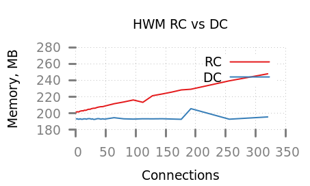
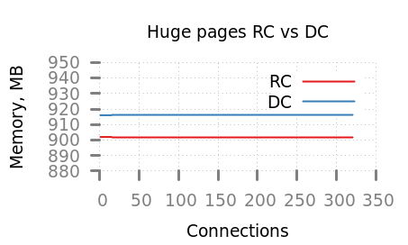
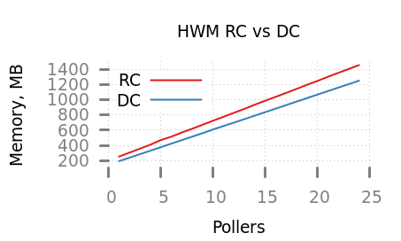
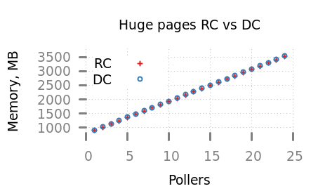
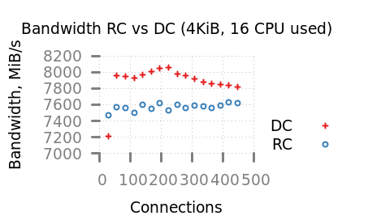
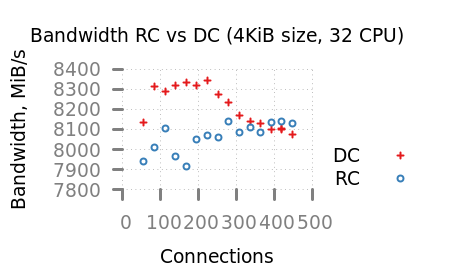
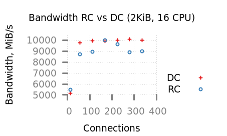
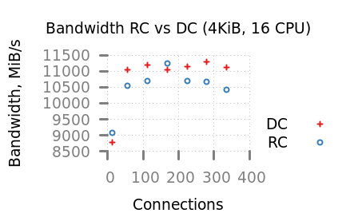
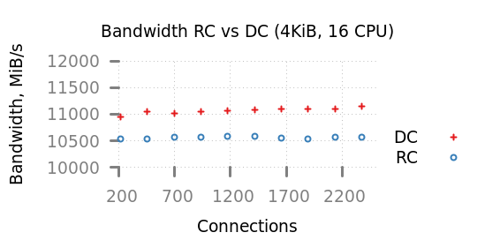

* DC how to build
 SPDK DC requires rdma_core version supporting qp number allocation (commit 339e6e28090de available from v34.0)
 You can point to the directory where such rdma-core version installed 
 #+BEGIN_SRC shell
 ./configure --with-rdma=mlx5_dv_dc --prefix=$PWD/install  --disable-unit-tests --with-rdma-path=../rdma-core/build  
 #+END_SRC
 
 DC requires SRQ on inititor side so we added some options to configure depth:
 - nvme_perf
   + --srq-depth 160 
 - bdevperf can be configured via
   #+BEGIN_SRC shell
   $SPDK_DIR/scripts/rpc.py bdev_nvme_transport_set_options -s 200 -t RDMA
   #+END_SRC 
 - fio 
   #+BEGIN_SRC ini
   [write-and-verify]
   rw=randwrite
   bs=4k
   direct=1
   ioengine=spdk
   iodepth=16
   thread=1
   verify=crc32c
   time_based=1
   runtime=10
   srq_depth=256
   filename=trtype=RDMA adrfam=IPv4 traddr=1.1.1.1 trsvcid=4420
   #+END_SRC
* Memory consumption analysis
  All data collected on *jazz* partition where ConnectX-5 connected via 8x PCI lanes
** Test Memory consumption one SPDK_TGT poller to many connections

 

| Connections | RC Huge memory, MB | RC HWM, MB | DC Huge memory, MB | DC HWM, MB |
|-------------+--------------------+------------+--------------------+------------|
|           1 |                902 |    201.688 |                916 |    193.375 |
|           2 |                902 |    201.844 |                916 |    193.379 |
|           3 |                902 |    201.996 |                916 |    193.379 |
|           4 |                902 |    201.766 |                916 |    192.977 |
|           5 |                902 |    201.918 |                916 |    192.973 |
|           6 |                902 |    202.082 |                916 |    192.977 |
|           7 |                902 |    202.629 |                916 |    193.371 |
|           8 |                902 |    202.793 |                916 |    193.375 |
|           9 |                902 |    202.953 |                916 |    192.988 |
|          10 |                902 |    203.102 |                916 |    192.988 |
|          11 |                902 |    203.266 |                916 |    192.988 |
|          12 |                902 |    203.031 |                916 |    192.988 |
|          13 |                902 |    203.188 |                916 |    193.375 |
|          14 |                902 |    203.738 |                916 |    193.383 |
|          15 |                902 |    203.898 |                916 |    193.383 |
|          16 |                902 |    203.664 |                916 |    193.387 |
|          18 |                902 |    204.023 |                916 |        193 |
|          20 |                902 |    204.734 |                916 |    193.387 |
|          22 |                902 |    205.051 |                916 |    193.387 |
|          24 |                902 |    204.973 |                916 |    193.395 |
|          26 |                902 |    205.676 |                916 |    193.008 |
|          28 |                902 |    205.996 |                916 |    193.402 |
|          30 |                902 |    206.312 |                916 |    193.004 |
|          32 |                902 |    206.238 |                916 |    193.008 |
|          36 |                902 |    207.312 |                916 |    193.422 |
|          39 |                902 |    207.777 |                916 |    193.422 |
|          42 |                902 |     208.16 |                916 |    193.039 |
|          45 |                902 |    208.188 |                916 |    193.438 |
|          48 |                902 |    208.809 |                916 |    193.035 |
|          64 |                902 |    211.711 |                916 |    194.816 |
|          80 |                902 |    213.859 |                916 |    193.445 |
|          96 |                902 |    216.285 |                916 |    193.102 |
|         112 |                902 |    213.477 |                916 |    193.492 |
|         128 |                902 |    221.441 |                916 |    193.408 |
|         144 |                902 |    223.543 |                916 |    193.512 |
|         160 |                902 |     225.84 |                916 |    193.199 |
|         176 |                902 |    228.477 |                916 |    192.859 |
|         192 |                902 |    229.301 |                916 |    205.742 |
|         256 |                902 |     239.52 |                916 |    192.996 |
|         320 |                902 |    248.016 |                916 |    195.719 |
|-------------+--------------------+------------+--------------------+------------|
** Test Memory consumption 320 connections to 1..24 SPDK_TGT pollers, bdevperf test
 
| TGT pollers | RC Huge, MB | RC HWM, MB | DC Huge, MB | DC HWM, MB |
|-------------+-------------+------------+-------------+------------|
|           1 |         902 |    253.023 |         916 |     193.48 |
|           2 |        1016 |    304.754 |        1030 |    239.027 |
|           3 |        1130 |    357.078 |        1144 |    285.273 |
|           4 |        1244 |    409.633 |        1258 |    330.777 |
|           5 |        1358 |    469.785 |        1372 |     376.68 |
|           6 |        1472 |    514.008 |        1486 |    422.977 |
|           7 |        1586 |    568.176 |        1600 |    468.855 |
|           8 |        1700 |    617.973 |        1714 |    514.348 |
|           9 |        1814 |    670.559 |        1828 |    560.223 |
|          10 |        1928 |    723.758 |        1942 |    608.117 |
|          11 |        2042 |     774.59 |        2056 |    654.031 |
|          12 |        2156 |    826.758 |        2170 |    697.934 |
|          13 |        2270 |    878.098 |        2284 |    744.219 |
|          14 |        2384 |    933.277 |        2398 |    789.703 |
|          15 |        2498 |    985.305 |        2512 |    835.973 |
|          16 |        2612 |    1035.91 |        2626 |    881.496 |
|          17 |        2726 |     1087.5 |        2740 |    927.398 |
|          18 |        2840 |    1139.88 |        2854 |    973.668 |
|          19 |        2954 |    1194.44 |        2968 |    1019.53 |
|          20 |        3068 |    1244.24 |        3082 |    1065.44 |
|          21 |        3182 |    1298.48 |        3196 |    1111.33 |
|          22 |        3296 |    1350.62 |        3310 |    1157.22 |
|          23 |        3410 |    1401.21 |        3424 |    1202.81 |
|          24 |        3524 |    1452.99 |        3538 |    1248.62 |
** Test Memory consumption many SPDK_TGT poller to many connections
| TGT pollers | Connections | RC Huge memory, MB | RC HWM, MB | DC Huge memory, MB | DC HWM, MB |
|-------------+-------------+--------------------+------------+--------------------+------------|
|           1 |           1 |                902 |    201.289 |                916 |    192.984 |
|           1 |           2 |                902 |    201.887 |                916 |    192.594 |
|           2 |           2 |               1016 |    254.027 |               1030 |    240.898 |
|           2 |           4 |               1016 |    255.988 |               1030 |     238.91 |
|           3 |           3 |               1130 |        308 |               1144 |    284.836 |
|           3 |           6 |               1130 |    308.523 |               1144 |     284.43 |
|           4 |           4 |               1244 |     358.75 |               1258 |    330.668 |
|           4 |           8 |               1244 |    359.039 |               1258 |    330.762 |
|           5 |           5 |               1358 |    411.098 |               1372 |    376.195 |
|           5 |          10 |               1358 |     411.93 |               1372 |    378.168 |
|           6 |           6 |               1472 |    463.438 |               1486 |    422.164 |
|           6 |          12 |               1472 |    464.426 |               1486 |    422.559 |
|           7 |           7 |               1586 |    519.133 |               1600 |    467.941 |
|           7 |          14 |               1586 |    516.934 |               1600 |        470 |
|           8 |           8 |               1700 |    567.734 |               1714 |    513.867 |
|           8 |          16 |               1700 |    568.125 |               1714 |    515.844 |
|           9 |           9 |               1814 |    620.086 |               1828 |    560.109 |
|           9 |          18 |               1814 |    621.547 |               1828 |    562.152 |
|          10 |          10 |                    |            |               1942 |    605.602 |
|          10 |          20 |               1928 |     672.43 |               1942 |    605.625 |
|          11 |          11 |                    |            |               2056 |    651.527 |
|          11 |          22 |               2042 |    725.172 |               2056 |    651.938 |
|          12 |          12 |               2156 |    777.164 |               2170 |    697.812 |
|          12 |          24 |               2156 |    777.555 |               2170 |    697.832 |
|-------------+-------------+--------------------+------------+--------------------+------------|

* Performance analysis 
** Connection time analyis
  
  The following is result of 
  #+BEGIN_SRC shell
  spdk_nvme_perf --srq-depth 160  -q 1  -o 4096 -w randread -t 10  -c 0xF -M 50
  #+END_SRC
  [[https://wikinox.mellanox.com/pages/viewpage.action?spaceKey=SWX&title=NVMe+connect+time+measurement][Measurement methodology]]
  - RC
    Controller attach time is 19516.672 us
   | Core | connect time, us | total time, us | average latency, us |
   |------+------------------+----------------+---------------------|
   |    0 |         5912.740 |       9676.992 |                7.45 |
   |    1 |        15399.281 |      18986.030 |                7.44 |
   |    2 |        25388.414 |      28982.877 |                7.44 |
   |    3 |        35325.403 |      38961.295 |                7.44 |

  - DC
   Controller attach time is 18807.400 us
   | Core | connect time, us | total time, us | average latency, us |
   |------+------------------+----------------+---------------------|
   |    0 |        14022.894 |      20529.063 |               10.65 |
   |    1 |        23642.888 |      30305.155 |               10.66 |
   |    2 |        33663.324 |      40493.109 |               10.65 |
   |    3 |        43579.491 |      50570.572 |               10.65 |

** Ray
 - CPU: 2x AMD EPYC 7282 16-Core Processor
 - Memory: 128GiB
 - OS: Red Hat Enterprise Linux Server, 7.6 (Maipo)
 - HCA: Mellanox Technologies MT28908 Family [ConnectX-6], PN: MCX654106A-HCAT rev. A8
 - performance testing tool: nvmeperf, random read mode
*** 1 Server, 7 nvmeperf nodes
QD=1
IO_SIZE=4096
Cores on server=16

| CORES_ON_PERFS | DC MiB/s | DC Latency,us | RC MiB/s | RC Latency,us | Bandwidth gain, % | Latency gain, % |
|----------------+----------+---------------+----------+---------------+-------------------+-----------------|
|             28 |  7215.20 |         15.15 |  7467.88 |         14.66 |             -3.38 |           -3.21 |
|             56 |  7956.78 |         27.51 |  7576.19 |         28.88 |              5.02 |            4.98 |
|             84 |  7952.38 |         41.27 |  7557.89 |         43.44 |              5.22 |            5.25 |
|            112 |  7930.37 |         55.16 |  7502.58 |         58.31 |              5.70 |            5.70 |
|            140 |  7973.74 |         68.58 |  7606.42 |         71.89 |              4.83 |            4.83 |
|            168 |  8011.28 |         81.92 |  7554.22 |         86.86 |              6.05 |            6.04 |
|            196 |  8049.87 |         95.11 |  7621.09 |        100.45 |              5.63 |            5.62 |
|            252 |  7977.15 |        123.39 |  7604.03 |        129.44 |              4.91 |            4.90 |
|            224 |  8057.20 |        108.59 |  7529.40 |        116.20 |              7.01 |            7.01 |
|            280 |  7956.84 |        137.45 |  7560.14 |        144.66 |              5.25 |            5.25 |
|            308 |  7916.48 |        151.96 |  7588.90 |        158.52 |              4.32 |            4.32 |
|            336 |  7876.12 |        166.62 |  7579.08 |        173.16 |              3.92 |            3.92 |
|            364 |  7865.16 |        180.76 |  7557.72 |        188.12 |              4.07 |            4.07 |
|            392 |  7849.24 |        195.07 |  7596.53 |        201.55 |              3.33 |            3.33 |
|            420 |  7837.26 |        209.32 |  7627.94 |        215.06 |              2.74 |            2.74 |
|            448 |  7816.73 |        223.86 |  7626.16 |        229.45 |              2.50 |            2.50 |
#+TBLFM: $6=(($2-$4)/$4)*100;%0.2f::$7=(($5-$3)/$3)*100;%0.2f::$2=$2;%0.2f::$3=$3;%0.2f::$4=$4;%0.2f::$5=$5;%0.2f

QD=1
IO_SIZE=4096
Cores on server=32

| CORES_ON_PERFS | DC MiB/s | DC Latency,us | RC MiB/s | RC Latency,us | Bandwidth gain, % | Latency gain, % |
|----------------+----------+---------------+----------+---------------+-------------------+-----------------|
|             28 |  6822.74 |         16.04 |  6924.85 |         15.78 |             -1.47 |           -1.62 |
|             56 |  8137.82 |         26.87 |  7941.06 |         27.55 |              2.48 |            2.53 |
|             84 |  8314.38 |         39.46 |  8012.08 |         40.95 |              3.77 |            3.78 |
|            112 |  8288.71 |         52.79 |  8107.79 |         53.96 |              2.23 |            2.22 |
|            140 |  8319.68 |         65.73 |  7968.47 |         68.62 |              4.41 |            4.40 |
|            168 |  8332.50 |         78.75 |  7918.15 |         82.87 |              5.23 |            5.23 |
|            196 |  8318.98 |         92.03 |  8050.45 |         95.09 |              3.34 |            3.33 |
|            224 |  8342.69 |        104.87 |  8071.19 |        108.50 |              3.36 |            3.46 |
|            252 |  8275.00 |        118.95 |  8059.81 |        122.12 |              2.67 |            2.66 |
|            280 |  8233.92 |        132.83 |  8142.06 |        134.40 |              1.13 |            1.18 |
|            308 |  8172.10 |        147.21 |  8086.67 |        148.76 |              1.06 |            1.05 |
|            336 |  8142.90 |        161.17 |  8112.50 |        161.85 |              0.37 |            0.42 |
|            364 |  8128.43 |        174.91 |  8088.46 |        175.77 |              0.49 |            0.49 |
|            392 |  8099.98 |        189.03 |  8134.98 |        188.21 |             -0.43 |           -0.43 |
|            420 |  8103.74 |        202.44 |  8138.49 |        201.65 |             -0.43 |           -0.39 |
|            448 |  8073.97 |        216.72 |  8129.23 |        215.31 |             -0.68 |           -0.65 |
#+TBLFM: $6=(($2-$4)/$4)*100;%0.2f::$7=(($5-$3)/$3)*100;%0.2f::$2=$2;%0.2f::$3=$3;%0.2f::$4=$4;%0.2f::$5=$5;%0.2f

QD=1
IO_SIZE=512
Cores on server=16
| CORES_ON_PERFS | DC MiB/s | DC Latency,us | RC MiB/s | RC Latency,us | Bandwidth gain, % | Latency gain, % |
|----------------+----------+---------------+----------+---------------+-------------------+-----------------|
|             28 |   887.13 |         15.40 |   913.17 |         14.96 |             -2.85 |           -2.86 |
|             56 |   987.53 |         27.68 |   991.92 |         27.56 |             -0.44 |           -0.43 |
|             84 |   986.86 |         41.57 |   987.95 |         41.51 |             -0.11 |           -0.14 |
|            112 |   986.05 |         55.45 |   997.71 |         54.80 |             -1.17 |           -1.17 |
|            140 |   985.82 |         69.33 |   997.66 |         68.51 |             -1.19 |           -1.18 |
|            168 |   986.01 |         83.21 |  1000.19 |         82.00 |             -1.42 |           -1.45 |
|            196 |   986.99 |         96.95 |  1001.41 |         95.56 |             -1.44 |           -1.43 |
|            224 |   987.09 |        110.79 |  1000.12 |        109.35 |             -1.30 |           -1.30 |
|            252 |   987.75 |        124.56 |  1002.24 |        122.76 |             -1.45 |           -1.45 |
|            280 |   987.71 |        138.41 |  1003.84 |        136.18 |             -1.61 |           -1.61 |
|            308 |   987.46 |        152.28 |  1002.10 |        150.06 |             -1.46 |           -1.46 |
|            336 |   987.67 |        166.10 |  1002.52 |        163.63 |             -1.48 |           -1.49 |
|            364 |   987.51 |        179.96 |  1005.81 |        176.69 |             -1.82 |           -1.82 |
|            392 |   987.23 |        193.86 |  1005.93 |        190.26 |             -1.86 |           -1.86 |
|            420 |   986.91 |        207.78 |  1003.28 |        204.39 |             -1.63 |           -1.63 |
|            448 |   987.59 |        221.48 |  1003.67 |        217.93 |             -1.60 |           -1.60 |
#+TBLFM: $6=(($2-$4)/$4)*100;%0.2f::$7=(($5-$3)/$3)*100;%0.2f::$2=$2;%0.2f::$3=$3;%0.2f::$4=$4;%0.2f::$5=$5;%0.2f

*** 1 Server, 5 nvmeperf nodes

Mode=RC
QUEUE_DEPTH=1
IO_SIZE=4096
| CORES_ON_SERVERS | CORES_ON_PERFS | HUGE_MB |     HWM_MB |    IOPS |       MiB/s | Latency,us | Latency(stddev) |
|------------------+----------------+---------+------------+---------+-------------+------------+-----------------|
|                1 |             80 |     830 | 178.047000 | 1094140 | 4274.000000 |  73.182000 |        2.325610 |
|                4 |             80 |     956 | 230.508000 | 2103780 | 8217.880000 |  38.028000 |        0.661949 |
|                8 |            140 |    1124 | 312.363000 | 2019270 | 7887.780000 |  69.340000 |        1.314730 |

Mode=RC
QUEUE_DEPTH=32
IO_SIZE=131072
| CORES_ON_SERVERS | CORES_ON_PERFS | HUGE_MB |     HWM_MB |   IOPS |        MiB/s |   Latency,us | Latency(stddev) |
|------------------+----------------+---------+------------+--------+--------------+--------------+-----------------|
|                8 |            140 |    1124 | 310.367000 | 144679 | 18084.900000 | 31014.800000 |     1542.530000 |

Mode=DC
QUEUE_DEPTH=32
IO_SIZE=131072
| CORES_ON_SERVERS | CORES_ON_PERFS | HUGE_MB |     HWM_MB |   IOPS |        MiB/s |   Latency,us | Latency(stddev) |
|------------------+----------------+---------+------------+--------+--------------+--------------+-----------------|
|                8 |            140 |    1138 | 275.566000 | 104287 | 13035.900000 | 42862.900000 |      102.472000 |
|                8 |            240 |    1138 | 275.289000 |  87452 | 10931.500000 | 69787.300000 |      532.196000 |
|               32 |            240 |    2146 | 664.258000 | 129560 | 16195.000000 | 58786.900000 |     2020.430000 |
|               32 |            120 |    2146 | 663.734000 | 141187 | 17648.300000 | 27108.800000 |      247.530000 |
|               32 |            140 |    2146 | 664.148000 | 127664 | 15958.000000 | 34995.900000 |      672.947000 |

** Jazz
 - CPU: Intel(R) Xeon(R) CPU E5-2680 v4 @ 2.40GHz
 - Memory: 128GiB
 - OS: Red Hat Enterprise Linux Server release 7.6 (Maipo)
 - HCA: Mellanox Technologies MT28908 Family [ConnectX-6], PN:  MCX654106A-HCAT  rev. A5
        Mellanox Technologies MT27800 Family [ConnectX-5], PN: MCX556A-ECAT  rev. A3
 - performance testing tool: nvmeperf, random read mode
 #+BEGIN_EXAMPLE
 ib_read_bw  1.1.3.18 -D 20  -d mlx5_0 --disable_pcie_relaxed -s 4096
---------------------------------------------------------------------------------------
                    RDMA_Read BW Test
 Dual-port       : OFF          Device         : mlx5_0
 Number of qps   : 1            Transport type : IB
 Connection type : RC           Using SRQ      : OFF
 PCIe relax order: OFF
 ibv_wr* API     : ON
 TX depth        : 128
 CQ Moderation   : 100
 Mtu             : 4096[B]
 Link type       : IB
 Outstand reads  : 16
 rdma_cm QPs     : OFF
 Data ex. method : Ethernet
---------------------------------------------------------------------------------------
 local address: LID 0x34 QPN 0x1c5d PSN 0xafd28c OUT 0x10 RKey 0x166c6d VAddr 0x00000001c67000
 remote address: LID 0x27 QPN 0x145f9 PSN 0x9d782 OUT 0x10 RKey 0x020437 VAddr 0x007f83ec00c000
---------------------------------------------------------------------------------------
 #bytes     #iterations    BW peak[MB/sec]    BW average[MB/sec]   MsgRate[Mpps]
 4096       30144500         0.00               11774.34                   3.014231
---------------------------------------------------------------------------------------
  #+END_EXAMPLE
  

Cores on server=16
QD=1
IO_SIZE=2048

| CORES_ON_PERFS | DC MiB/s | DC Latency,us | RC MiB/s | RC Latency,us | Bandwidth gain, % | Latency gain, % |
|----------------+----------+---------------+----------+---------------+-------------------+-----------------|
|             14 |  5169.08 |          5.27 |  5465.63 |          4.99 |             -5.43 |           -5.31 |
|             56 |  9778.08 |         11.21 |  8731.48 |         12.51 |             11.99 |           11.60 |
|            112 |  9942.01 |         22.02 |  8963.09 |         24.37 |             10.92 |           10.67 |
|            168 |  9883.43 |         33.16 | 10003.50 |         32.96 |             -1.20 |           -0.60 |
|            224 |  9984.45 |         43.75 |  9605.79 |         45.52 |              3.94 |            4.05 |
|            280 | 10061.70 |         54.31 |  8918.37 |         61.22 |             12.82 |           12.72 |
|            336 | 10004.50 |         65.57 |  8988.45 |         73.07 |             11.30 |           11.44 |
#+TBLFM: $6=(($2-$4)/$4)*100;%0.2f::$7=(($5-$3)/$3)*100;%0.2f::$2=$2;%0.2f::$3=$3;%0.2f::$4=$4;%0.2f::$5=$5;%0.2f

Addition data jazz 2K RC batch 
| 16 |  14 | 2612 |  987.348000 | 2777360 | 5424.540000 |  5.026430 | 0.093320 |
| 16 |  56 | 2612 |  995.359000 | 4540211 | 8867.610000 | 12.311400 | 0.352356 |
| 16 | 112 | 2612 | 1002.510000 | 4638480 | 9059.540000 | 24.097100 | 0.223173 |
| 16 | 168 | 2612 | 1010.960000 | 4811900 | 9398.230000 | 34.865700 | 0.286474 |
| 16 | 224 | 2612 | 1019.820000 | 4690110 | 9160.380000 | 47.730000 | 0.308105 |
| 16 | 280 | 2612 | 1031.090000 | 4971270 | 9709.520000 | 56.297900 | 0.698817 |
| 16 | 336 | 2612 | 1037.550000 | 4702170 | 9183.940000 | 71.502900 | 2.358060 |

Cores on server=16
QD=1
IO_SIZE=4096

| CORES_ON_PERFS | DC MiB/s | DC Latency,us | RC MiB/s | RC Latency,us | Bandwidth gain, % | Latency gain, % |
|----------------+----------+---------------+----------+---------------+-------------------+-----------------|
|             14 |  8773.04 |          6.21 |  9096.37 |          6.00 |             -3.55 |           -3.38 |
|             56 | 11052.90 |         19.98 | 10546.50 |         21.02 |              4.80 |            5.21 |
|            112 | 11187.40 |         39.07 | 10704.70 |         40.83 |              4.51 |            4.50 |
|            168 | 11051.30 |         59.36 | 11250.70 |         58.31 |             -1.77 |           -1.77 |
|            224 | 11137.70 |         78.50 | 10704.00 |         81.73 |              4.05 |            4.11 |
|            280 | 11287.80 |         96.95 | 10664.30 |        102.49 |              5.85 |            5.71 |
|            336 | 11126.90 |        117.94 | 10437.80 |        125.77 |              6.60 |            6.64 |
#+TBLFM: $6=(($2-$4)/$4)*100;%0.2f::$7=(($5-$3)/$3)*100;%0.2f::$2=$2;%0.2f::$3=$3;%0.2f::$4=$4;%0.2f::$5=$5;%0.2f

QD=32
IO_SIZE=128K
| CORES_ON_PERFS | DC MiB/s | DC Latency,us | RC MiB/s | RC Latency,us | Bandwidth gain, % | Latency gain, % |
|----------------+----------+---------------+----------+---------------+-------------------+-----------------|
|             14 | 12651.50 |       4426.60 | 12669.90 |       4423.30 |             -0.15 |           -0.07 |
|             56 | 12806.90 |      17535.20 | 12536.30 |      17984.00 |              2.16 |            2.56 |
|            112 | 12841.90 |      34925.70 | 12776.10 |      35122.40 |              0.52 |            0.56 |
|            168 | 13021.90 |      51741.00 | 12696.40 |      53109.60 |              2.56 |            2.65 |
|            224 | 12946.90 |      69246.80 | 12945.40 |      69597.10 |              0.01 |            0.51 |
|            280 | 13144.90 |      85445.30 | 13012.90 |      86541.10 |              1.01 |            1.28 |
|            336 | 12989.50 |     103480.00 | 13198.80 |     103159.00 |             -1.59 |           -0.31 |
#+TBLFM: $6=(($2-$4)/$4)*100;%0.2f::$7=(($5-$3)/$3)*100;%0.2f::$2=$2;%0.2f::$3=$3;%0.2f::$4=$4;%0.2f::$5=$5;%0.2f

*** DC vs RC performance testing, queue depth=1, io size=4k, 320 connections to 1..24 SPDK_TGT pollers, spdk nvmeperf test
| CORES | DC IOPS | RC IOPS |    DC MiB/s |    RC MiB/s |   DC Lat,us |  RC Lat,us |
|-------+---------+---------+-------------+-------------+-------------+------------|
|     1 |  244125 |  552139 |  953.620000 | 2156.810000 | 1315.250000 | 614.180000 |
|     2 |  656807 | 1262740 | 2565.640000 | 4932.580000 |  491.802000 | 256.515000 |
|     3 |  928910 | 1392370 | 3628.550000 | 5438.950000 |  360.496000 | 222.304000 |
|     4 | 1137710 | 1435290 | 4444.200000 | 5606.620000 |  283.962000 | 224.537000 |
|     5 | 1269110 | 1509550 | 4957.450000 | 5896.670000 |  248.494000 | 215.084000 |
|     6 | 1371180 | 1547770 | 5356.160000 | 6045.970000 |  213.977000 | 217.245000 |
|     7 | 1403680 | 1543030 | 5483.140000 | 6027.460000 |  228.836000 | 212.065000 |
|     8 | 1423830 | 1468480 | 5561.820000 | 5736.260000 |  215.044000 | 208.451000 |
|     9 | 1487620 | 1455660 | 5811.040000 | 5686.160000 |  218.143000 | 220.931000 |
|    10 | 1512100 | 1537870 | 5906.650000 | 6007.320000 |  204.604000 | 211.123000 |
|    11 | 1508810 | 1530010 | 5893.790000 | 5976.580000 |  203.997000 | 212.466000 |
|    12 | 1504950 | 1485840 | 5878.700000 | 5804.060000 |  215.248000 | 205.594000 |
|    13 | 1464600 | 1564800 | 5721.090000 | 6112.510000 |  209.678000 | 207.468000 |
|    14 | 1475170 | 1530750 | 5762.400000 | 5979.460000 |  207.713000 | 210.841000 |
|    15 | 1479860 | 1641090 | 5780.680000 | 6410.490000 |  207.902000 | 186.614000 |
|    16 | 1482542 | 1556400 | 5791.170000 | 6079.710000 |  205.897000 | 208.165000 |
|    17 | 1570080 | 1531910 | 6133.110000 | 5984.020000 |  196.952000 | 212.343000 |
|    18 | 1566280 | 1588330 | 6118.290000 | 6204.440000 |  208.339000 | 207.062000 |
|    19 | 1517820 | 1565020 | 5928.960000 | 6113.380000 |  211.428000 | 196.385000 |
|    20 | 1511500 | 1577876 | 5904.320000 | 6163.580000 |  192.857000 | 206.752000 |
|    21 | 1471500 | 1679010 | 5748.030000 | 6558.640000 |  218.776000 | 202.586000 |
|    22 | 1475910 | 1635740 | 5765.300000 | 6389.600000 |  207.385000 | 201.254000 |
|    23 | 1473520 | 1697200 | 5755.960000 | 6629.640000 |  208.364000 | 194.717000 |
|    24 | 1457460 | 1284780 | 5693.240000 | 5018.680000 |  219.964000 | 201.684000 |

** Hercules
 - CPU:  Intel(R) Xeon(R) CPU E5-2697A v4 @ 2.60GHz
 - Memory: 256GiB
 - OS: Red Hat Enterprise Linux Server release 7.6 (Maipo)
 - HCA: Mellanox Technologies MT28908 Family [ConnectX-6], PN: MCX653106A-ECAT  rev. AC
 - performance testing tool: nvmeperf, random read mode

#+BEGIN_EXAMPLE
  ib_read_bw  172.17.11.1 -D 20  -d mlx5_0 --disable_pcie_relaxed -s 4096
---------------------------------------------------------------------------------------
                    RDMA_Read BW Test
 Dual-port       : OFF          Device         : mlx5_0
 Number of qps   : 1            Transport type : IB
 Connection type : RC           Using SRQ      : OFF
 PCIe relax order: OFF
 ibv_wr* API     : ON
 TX depth        : 128
 CQ Moderation   : 100
 Mtu             : 4096[B]
 Link type       : IB
 Outstand reads  : 16
 rdma_cm QPs     : OFF
 Data ex. method : Ethernet
---------------------------------------------------------------------------------------
 local address: LID 0x46 QPN 0x0047 PSN 0x7188b7 OUT 0x10 RKey 0x002404 VAddr 0x00000000637000
 remote address: LID 0x20 QPN 0x0047 PSN 0x289a47 OUT 0x10 RKey 0x17fedd VAddr 0x007ffff7f7a000
---------------------------------------------------------------------------------------
 #bytes     #iterations    BW peak[MB/sec]    BW average[MB/sec]   MsgRate[Mpps]
 4096       29547600         0.00               11540.99                   2.954493
---------------------------------------------------------------------------------------
#+END_EXAMPLE

QD=1
IO_SIZE=4096
Cores on server=16
Cores per initiator=24
Mean on 10 runs for 60 seconds for every qp number

| CORES_ON_PERFS | DC MiB/s |  stdev | DC Latency,us | stdev | RC MiB/s | RC stdev | RC Latency,us | stdev | Bandwidth gain, % | Latency gain, % |
|----------------+----------+--------+---------------+-------+----------+----------+---------------+-------+-------------------+-----------------|
|            216 | 10960.63 |  56.06 |         75.41 |  5.14 | 10544.34 |    30.18 |         80.00 |  0.22 |              3.95 |            6.08 |
|            456 | 11050.82 | 117.56 |        156.70 | 11.04 | 10543.26 |    42.28 |        162.51 | 14.40 |              4.81 |            3.71 |
|            696 | 11015.78 |  37.88 |        239.09 | 13.34 | 10564.44 |    36.74 |        244.57 | 15.37 |              4.27 |            2.29 |
|            936 | 11056.18 |  66.20 |        313.95 | 14.95 | 10568.64 |    27.59 |        331.68 | 17.39 |              4.61 |            5.65 |
|           1176 | 11068.45 |  65.51 |        413.86 |  4.77 | 10581.20 |    75.79 |        429.32 | 10.63 |              4.60 |            3.73 |
|           1416 | 11078.45 |  62.39 |        486.70 | 15.18 | 10580.41 |    92.17 |        510.31 | 17.69 |              4.71 |            4.85 |
|           1656 | 11110.20 |  65.00 |        554.29 |  5.04 | 10550.51 |    45.65 |        579.53 |  4.41 |              5.30 |            4.55 |
|           1896 | 11102.94 |  31.99 |        637.78 |  4.69 | 10541.92 |    36.25 |        675.16 |  4.42 |              5.32 |            5.86 |
|           2136 | 11109.30 |  85.62 |        721.50 |  5.48 | 10574.13 |    67.51 |        757.51 |  2.53 |              5.06 |            4.99 |
|           2376 | 11152.85 |  64.63 |        806.71 |  4.68 | 10572.62 |    41.74 |        850.54 |  4.32 |              5.49 |            5.43 |
#+TBLFM: $10=(($2-$6)/$6)*100;%0.2f::$11=(($8-$4)/$4)*100;%0.2f::$2=$2;%0.2f::$3=$3;%0.2f::$4=$4;%0.2f::$5=$5;%0.2f::$6=$6;%0.2f::$7=$7;%0.2f::$8=$8;%0.2f::$9=$9;%0.2f

QD=1
IO_SIZE=4096
Cores on server=32
Cores per initiator=24
| CORES_ON_PERFS | DC MiB/s | DC Latency,us | RC MiB/s | RC Latency,us | Bandwidth gain, % | Latency gain, % |
|----------------+----------+---------------+----------+---------------+-------------------+-----------------|
|            456 | 10750.20 |        165.71 | 11308.80 |        149.22 |             -4.94 |           -9.95 |
|            936 | 10767.20 |        304.77 | 10722.00 |        314.87 |              0.42 |            3.31 |
|           1176 | 10976.10 |        385.03 | 10673.60 |        430.77 |              2.83 |           11.88 |
|           1896 | 10827.80 |        650.26 | 10741.40 |        674.09 |              0.80 |            3.66 |
|           2376 | 10995.80 |        824.40 | 10637.80 |        847.72 |              3.37 |            2.83 |
#+TBLFM: $6=(($2-$4)/$4)*100;%0.2f::$7=(($5-$3)/$3)*100;%0.2f::$2=$2;%0.2f::$3=$3;%0.2f::$4=$4;%0.2f::$5=$5;%0.2f

